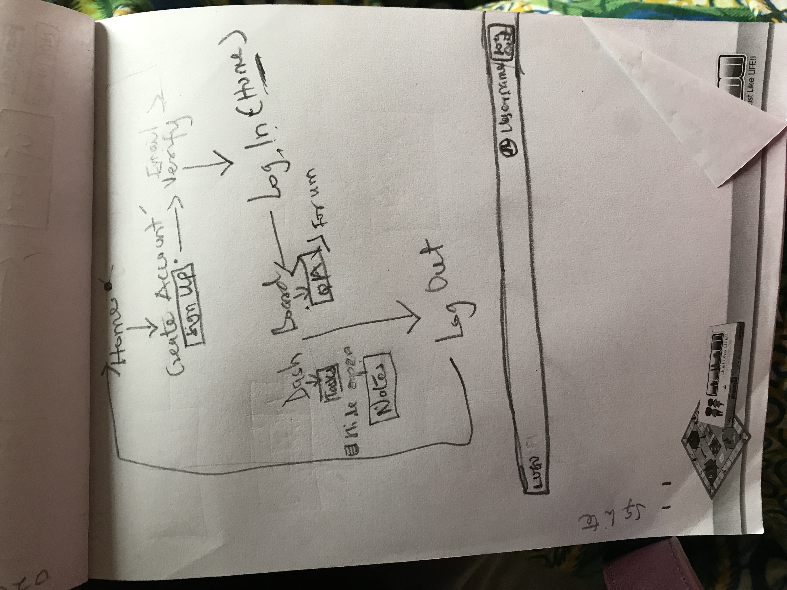
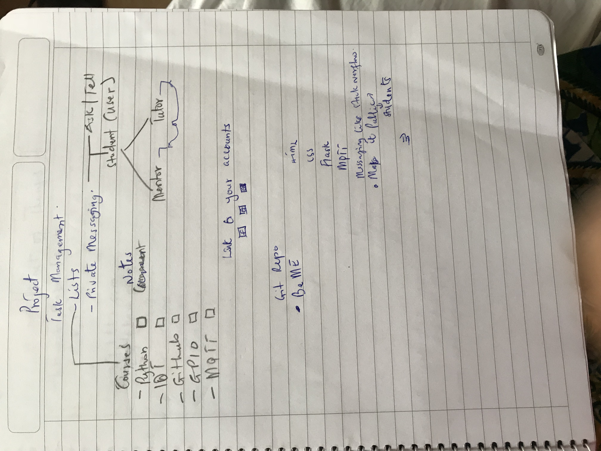
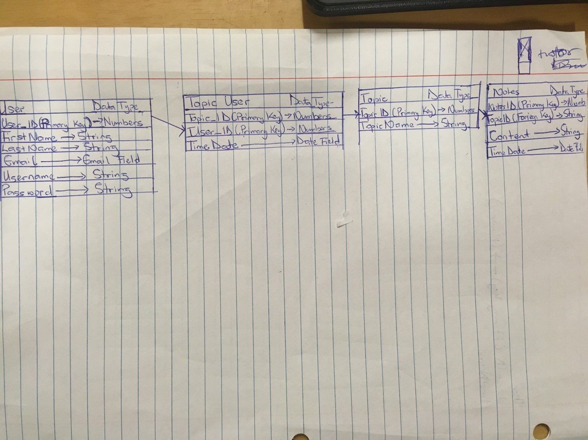
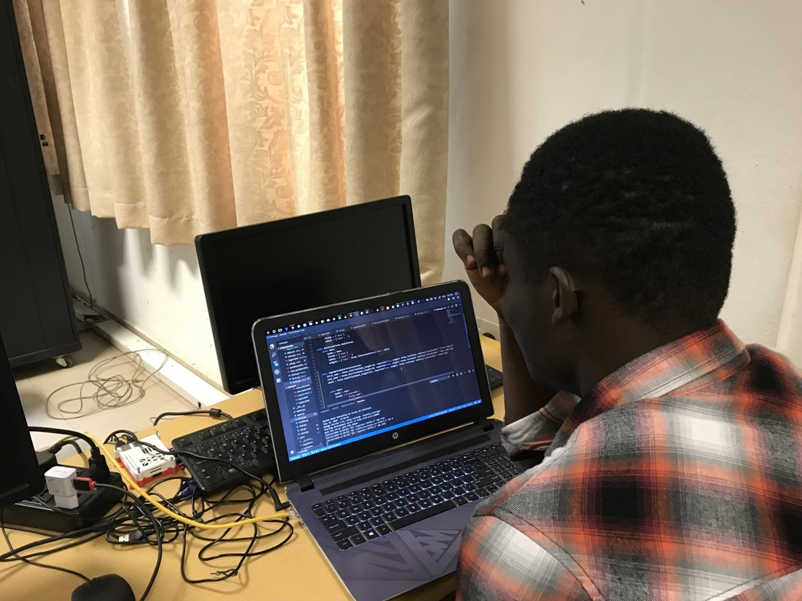
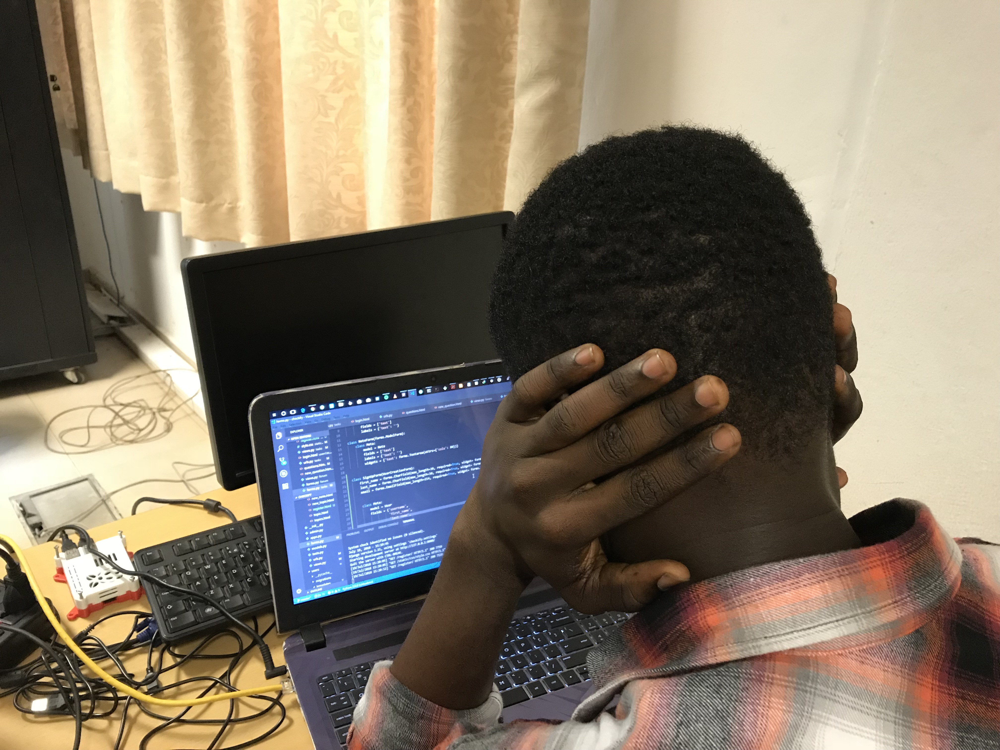
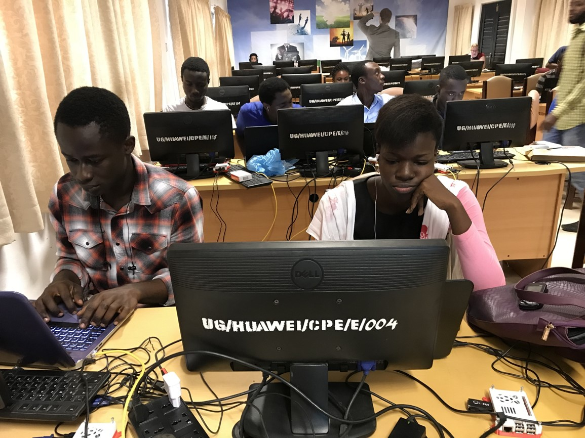

## CHECKIFY

#### The Task Management Forum

---

## The BeME Team

 BeME stands for **Be**rnard,**M**iriam and **E**merald

+++

The Team

 

---
 
 

## THE PROBLEM

- Difficulty in  tracking learning progress

+++

- Ineffective communication with tutors and co-participants after class 

---
 

## THE SOLUTION

+++

Checkify 

+++

- A task management application with an in-built forum. 

+++

- This helps a participant track his/her progress with tasks. 
- Take notes in real time.
- Ask Questions if they encounter any problems.

---

## DEMO

[Checkify](https://glblcdcheckify.herokuapp.com)

---

 

## PROCESS
 
+++

 Planning and Content Creation
  

+++

+++

+++

+++

+++

Front End Development

-  HTML
-   CSS
-    JS.

+++

 Back End Development 

- Django

- Database (Postgresql for production and Sqlite for Development)

+++

Graphics Design

- Logo Design

+++

- And all the wahala 

## CHALLENGES ENCOUNTERED

- Merging the frontend with the backend

+++

+++

+++

+++

- The planning

- Time management

 

## MOVING ON

- Our Major move is to have this app integrated into the Global Code program.

 

+++

- Add a feature that can distinguish a  tutor's contribution to the forum

+++

- Add a feature that can allow you to git add and commit write from the site with a virtual environment

THANK YOU FOR COMING 

:smiley:

