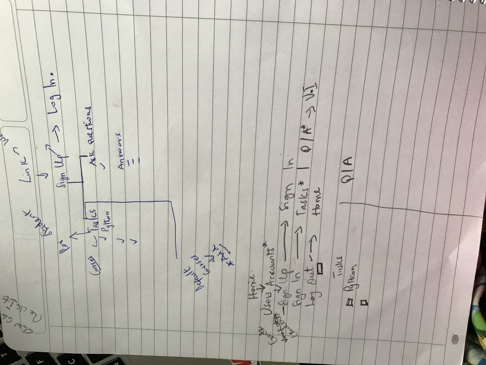

 

## CHECKIFY

#### The Task Management Forum

---

## The BeME Team

 BeME stands for **Be**rnard,**M**iriam and **E**merald

+++

That's Bernard, The Back End Manager

+++

That's Emerald, The Front End Manager

+++

 That's Miriam, The Middle End Manager

---
 
 

## THE PROBLEM

- Difficulty in  tracking learning progress

+++

- Ineffective communication with tutors and co-participants after class 

---
 

## THE SOLUTION

+++

Checkify 

+++

- A task management application with an in-built forum. 

+++

- This helps a participant track his/her progress with tasks. 
- Take notes in real time.
- Ask Questions if they encounter any problems.

---

## DEMO

---

 

## PROCESS
 
+++

 Planning and Content Creation
  

+++

+++

+++

+++

+++

- Front End Development (HTML, CSS, JS.

+++

- Back End Development (Django)

- Database (Postgresql for production and Sqlite for Development)

+++

- Graphics Design (Logo Design)

- And all the wahala 

## CHALLENGES ENCOUNTERED

- Merging the frontend with the backend
- The planning
- Time management

---
## Behind the scenes
 
+++

+++

+++

---

## MOVING ON

- Our Major move is to have this app integrated into the Global Code program.

 

+++

- Add a feature that can distinguish your tutors contribution to the forum

+++

THANK YOU FOR COMING

